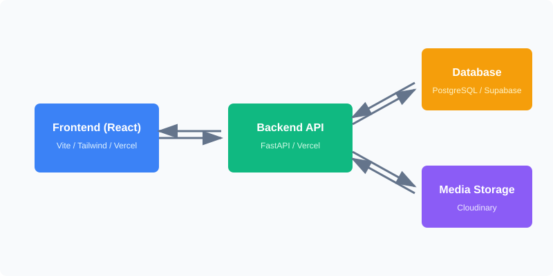
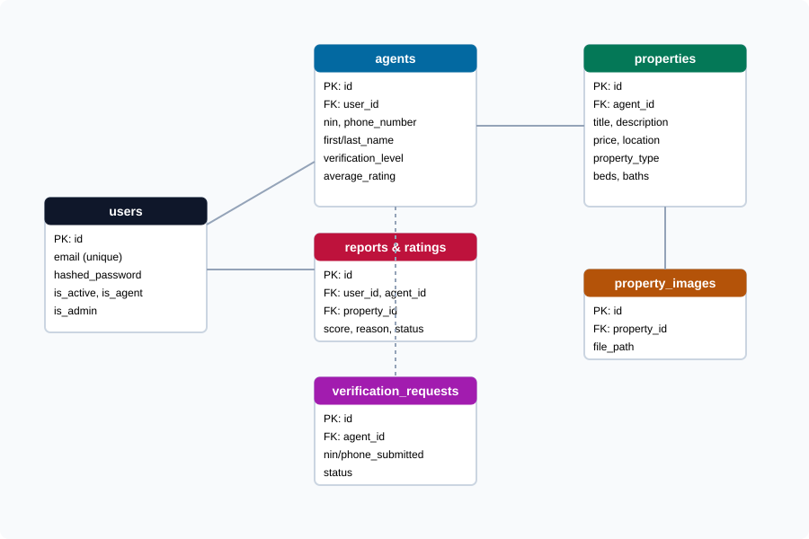

# HousingAgent
## A Secure and Modern Real Estate Platform

---

## 📌 Introduction & Problem Statement

**The Problem:**
Finding legitimate housing online is often plagued by scams, unverified listings, and unresponsive agents. 

**The Solution:**
HousingAgent is a secure, modern platform designed to connect home seekers with **strictly verified** real estate agents, ensuring trust, transparency, and high-quality property listings.

---

## 🛠 Architecture & Tech Stack

Our application is built for scalability and performance, following a decoupled architecture:

- **Frontend:** React.js, Tailwind CSS, Framer Motion
  - *Hosted securely on **Vercel** for fast, global delivery.*
- **Backend:** Python, FastAPI, SQLAlchemy
  - *Hosted on **Vercel** providing a robust Serverless API.*
- **Database:** PostgreSQL (*Hosted on **Supabase***)
- **Media Storage:** **Cloudinary** (*For optimized image delivery*)

---

## 🏛️ System Architecture

---

## 🗄️ Database Structure

*Core tables: Users, Agents, Properties, Property Images, Verification Requests, Ratings & Reports.*

---

## 🔌 API Overview

A comprehensive REST API grouped by entity, secured via JWT tokens:

* **Authentication (`/api/auth`)**: Login, Register, Profile fetching.
* **Properties (`/api/properties`)**: CRUD operations for property listings.
* **Agents (`/api/agents`)**: Agent onboarding, verification, and profile views.
* **Admin (`/api/admin`)**: User/Agent moderation and account suspensions.
* **Review/Report (`/api/reviews`)**: Agent ratings and platform moderation.

---

## 🧑‍💻 Key Features: User Experience

- **Browse & filter:** Seamlessly search for available properties based on your needs.
- **Immersive Viewing:** Beautiful property details pages featuring an interactive image gallery and full-screen carousel.
- **Direct Communication:** Instantly view verified agent contact information (Phone and Email) to easily reach out.
- **Community Trust:** Users can rate agents and report suspicious listings to help moderate the platform.

---

## 🏢 Key Features: Agent Dashboard

- **Agent Verification:** Users apply to become agents by submitting their National Identification Number (NIN) and phone number. Only Admin-verified agents can post listings.
- **Property Management:** A dedicated dashboard for agents to Create, Read, Update, and Delete (CRUD) their property listings.
- **Advanced Media Uploads:** Support for uploading multiple images per property, including image previews and deletion functionality during edits.

---

## 🔒 Security & Trust Mechanisms

- **Strict Role-Based Access Control (RBAC):** Only verified agents can post, edit, or delete listings. Regular users have read-only or interaction access.
- **Secure Authentication:** JWT-based secure log-ins.
- **Agent Accountability:** Agents are tied to their NIN and phone numbers. The public rating system and report functions ensure agents maintain professional standards.

---

## 🚀 Deployment & Production Environment

The application is fully live in production:
1. **Vercel (Frontend & Backend):** Ensures quick load times, seamless updates whenever UI changes are pushed, and reliable serverless API endpoint hosting.
2. **Supabase:** Handles our robust PostgreSQL database efficiently via connection pooling.
3. **Cloudinary:** Takes care of our persistent media without bogging down our main servers, delivering tailored image sizes on demand.

---

## 🌅 Conclusion & Future Scope

**Conclusion:** 
HousingAgent successfully provides a scalable, secure, and user-friendly solution to the modern housing hunt.

**Future Scope:**
- Real-time in-app messaging between users and agents.
- Interactive map-based property search.
- Virtual 3D property tours.

---

# Thank You!
### Any Questions?
